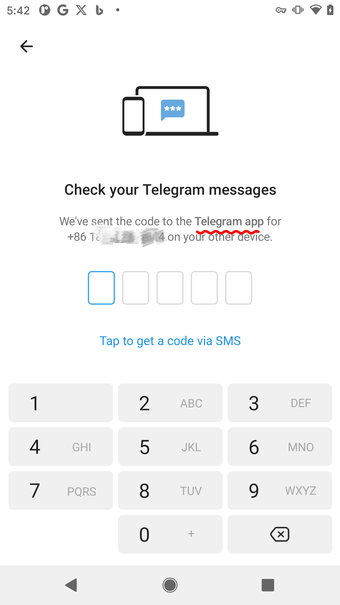
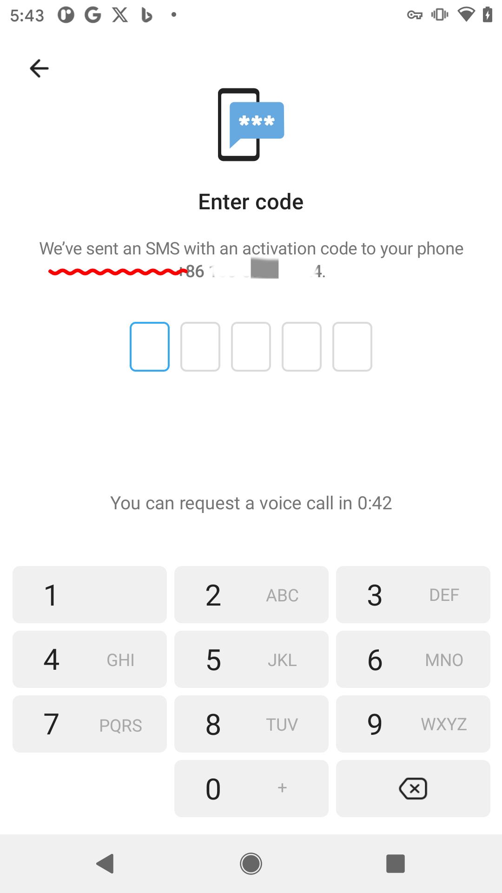

# Telegram

## 一直转卡，进不了输入验证码页面

检查VPN打开了没，有些VPN要开全局模式

## 收不到验证码

如下图，留意有没有`Telegram app`字样，有的话说明验证码发到你登录过的其他设备了，这种情况是收不短信验证码的

* 其他设备处于登录状态：前往已登录的`设备`->`Chats`->`Telegram`，会看到验证码
* 之前在其他设备登录过，比如换手机了：点下面的蓝色字（Tap to get a code via SMS）。点击后会跳到图2那样

---
**图2**
