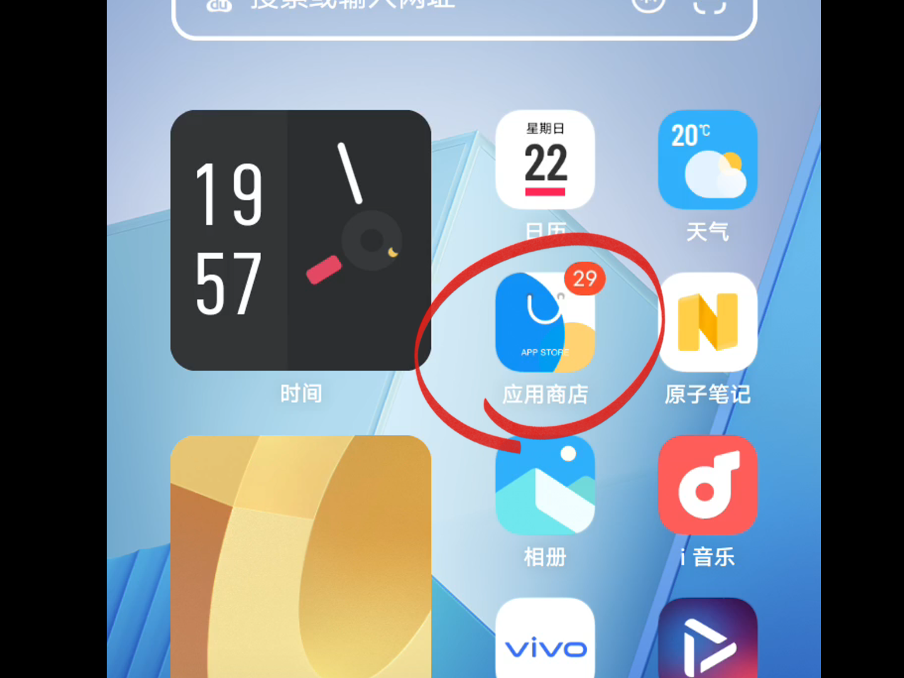
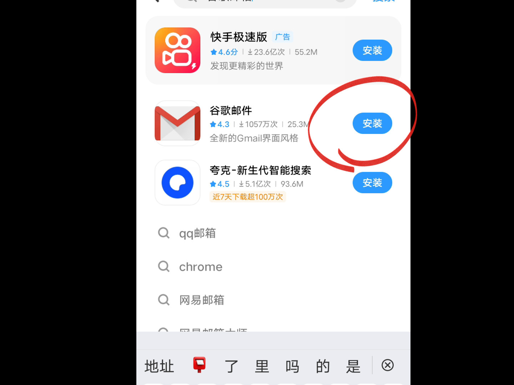
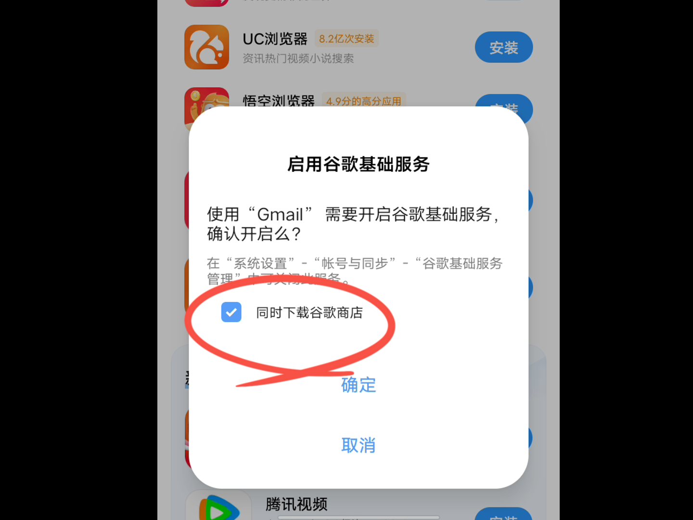
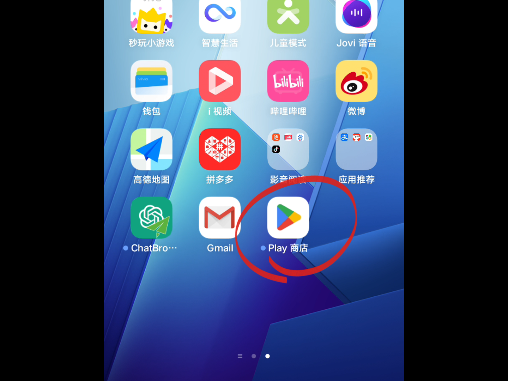

# 国产手机启用谷歌服务(以VIVO为例)

## 视频教程：

<iframe width="560" height="315" src="https://www.youtube.com/embed/fyEin7lNM18?si=3citU9cobpFJA66S" title="YouTube video player" frameborder="0" allow="accelerometer; autoplay; clipboard-write; encrypted-media; gyroscope; picture-in-picture; web-share" allowfullscreen></iframe>

[梯子](https://manual.chatbrowser.top/sell) 8.9一个月，youtube 4k播放无压力，chatGPT可用。提供7天试用，不限流量。

---

## 1.打开自带商店

## 2.搜索并安装谷歌邮箱

## 3.弹出的提示框选择“同时下载谷歌商店”

## 4. 谷歌三件套会自动在后台开始安装

